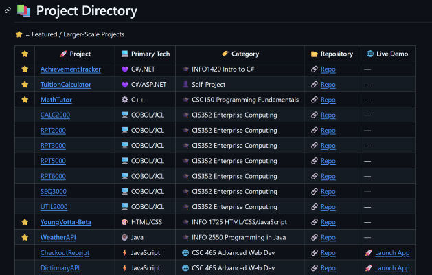

# Hi there, I'm Ben Stearns 👋

<p align="center">
  
</p>

<p align="center"><a href="mailto:bstearns07@gmail.com"></a><a href="https://www.bstearns.com"></a><a href="https://www.linkedin.com/in/ben-stearns-474261283/"></a></p>

<p align="center">
  
</p>

---

## 📚 Table of Contents

- 🚀 [About Me](#-about-me)
- 🔧 [Tech Experience](#-tech-experience)
- 📬 [Connect With Me](#-connect-with-me)
- 🧠 [Skills & Interests](#-skills--interests)
- 🎓 [Education](#-education)
- 🔥 [Currently Working On](#-currently-working-on)
- 📊 [My Stats](#-my-stats)
- 📈 [Activity](#-activity)
- 📁 [Project Directory](#-project-directory)

---

## 🚀 About Me

I'm a software development student focused on building full-stack applications using .NET and modern web technologies.

I enjoy solving real-world problems through code and have experience developing applications ranging from web interfaces to data-driven reporting systems.

I'm currently seeking opportunities to grow as a developer and contribute to meaningful projects.

- 🏦 Student at **Wayne State University – Wayne, NE**, pursuing a **Bachelor’s in Software Development**
- 👨🏻‍💻 Always building, learning, and open to new opportunities
- 🧠 Open to **collaboration projects** – let’s connect

### 🌐 Learn More About Me

💡 **Want to learn more about my work, projects, and professional background?**

> 📧 Resume: [View My Resume](docs/Resume_new/pdf)

> 🌐 References: [View My References](docs/Referneces_BenStearns.pdf)

Or check out my portfolio website below 👇:

<a href="https://www.bstearns.com/"></a>

---

## 🔧 Tech Experience

**Languages**
`C#` `C++` `Java` `Python` `JavaScript` `Typescript` `COBOL`

**Web & Frameworks**
`HTML` `CSS` `.NET` `ASP.NET` `Node.js` `Flask` `React` `Tailwind/Bootstrap CSS`

**Database**
`SQL` `Entity Framework` `Suapabase`

**Other**
`GitHub` `Networking` `Hardware` `Computer Science` `Responsive Design` `Unit Testing` `Full Stack Development`

## 📬 Connect With Me

- 📧 Email: [bstearns07@gmail.com](mailto:bstearns07@gmail.com)
- 🌐 Website: https://www.bstearns.com
- 🔗 Or connect with me on <a href="https://www.linkedin.com/in/ben-stearns-474261283/" target="_blank">**LinkedIn**</a>

---

## 🛠 Skills & Interests

I have a wide range of proficiencies across IT, including:

- 👨‍💻 Programming & Software Development
- 🌐 Web Design & Full-Stack Applications
- 🗃️ Databases & SQL
- 🌍 Networking
- 🛠️ Computer Hardware & Repair
- 🪟 Windows Server
- 🐧 Linux
- 📈 Project Management

My **passion is programming**, and I’m working toward my goal of becoming a **full-time software developer**.

---

## 🎓 Education

- 🎓 **AS – Northeast Community College (2022)**
- 🎓 **AAS – Information Technology, Northeast Community College (2025)**
- 🎓 **BS – Computer Information Systems - Programmer/Analyst, Wayne State College (Spring 2027 - anticipated)**
  - *Minor - Computer Science*

---

## 🔥 Currently Working On
- Finishing my BS degree at Wayne State College - Programmer/Analyst/Computer Science
- Developing software solutions as a Summer Software Development Intern at Daycos in Norfolk, NE
- Understand AI
- Typescript
- Svelte Framework

---

## 📊 My Stats


## 📈 Activity


---

## 📁 Project Directory
🔍 **Explore my projects in one place**

A centralized gateway to all repositories, organized for easy browsing.

```Preview Image:```



👉 [Go To Project Directory](https://github.com/bstearns07/bstearns07/blob/master/gateway.md)
