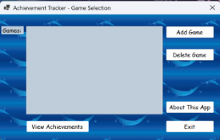
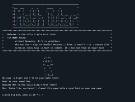
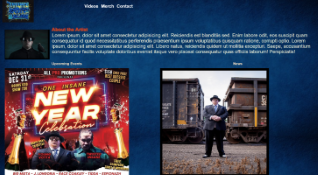
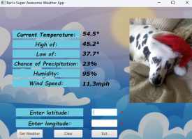
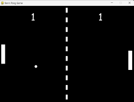
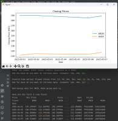
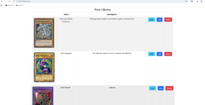
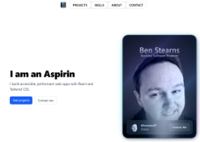

# 🚪 My Project Gateway

  

---

## 👋 Introduction
### 🧭 Your starting point for exploring my projects

Hi, my name is Ben Stearns and welcome to my **Project Gateway** — a centralized hub for exploring everything on my GitHub.

If you're not sure where to start in my GitHub, this guide organizes my projects by **technology** so you can quickly find what interests you.

---

## 🛠️ How to Use This Guide
1. 🔎 Browse the project directory below for something you'd like to learn more about
2. 📌 Click a project name to jump to its summary  
3. 🚀 Use the repository link to view the full project repository on GitHub
4. 🔗 Use the Live Demo link if provided to open the app in your browser and give it a try!

---

## 🌐 Learn More About Me
Want more details about my work and background?

``View my GitHub Profile Here:`` 

``Visit my website:`` 

---

# 📚 Project Directory

⭐ = Featured / Larger-Scale Projects

| ⭐ | 🚀 Project                                    | 💻 Primary Tech     | 🏷️ Category                        | 📂 Repository                                                       | 🌐 Live Demo                                                        |
|----|------------------------------------------------|---------------------|-------------------------------------|----------------------------------------------------------------------|---------------------------------------------------------------------|
| ⭐ | **[AchievementTracker](#achievementtracker)**  | 💜 C#/.NET          | 🎓 INFO1420 Intro to C#            | 🔗 [Repo](https://github.com/bstearns07/AchievementTracker-BDS)     | —                                                                   |
| ⭐ | **[TuitionCalculator](#tuitioncalculator)**   | 💜 C#/ASP.NET       | 👤 Self-Project                    | 🔗 [Repo](https://github.com/bstearns07/TuitionCalculator_WebApp)   | —                                                                   |
| ⭐ | **[MathTutor](#mathtutor)**                    | ⚙️ C++              | 🎓 CSC150 Programming Fundamentals | 🔗 [Repo](https://github.com/bstearns07/MathTutor)                  | —                                                                   |
|     | [CALC2000](#calc2000)                          | 🖥️ COBOL/JCL        | 🎓 CIS352 Enterprise Computing     | 🔗 [Repo](https://github.com/bstearns07/CALC2000)                   | —                                                                  |
|     | [RPT2000](#rpt2000)                            | 🖥️ COBOL/JCL        | 🎓 CIS352 Enterprise Computing     | 🔗 [Repo](https://github.com/bstearns07/RPT2000)                    | —                                                                  |
|     | [RPT3000](#rpt3000)                            | 🖥️ COBOL/JCL        | 🎓 CIS352 Enterprise Computing     | 🔗 [Repo](https://github.com/bstearns07/RPT3000)                    | —                                                                  |
|     | [RPT5000](#rpt5000)                            | 🖥️ COBOL/JCL        | 🎓 CIS352 Enterprise Computing     | 🔗 [Repo](https://github.com/bstearns07/RPT5000)                    | —                                                                  |
|     | [RPT6000](#rpt6000)                            | 🖥️ COBOL/JCL        | 🎓 CIS352 Enterprise Computing     | 🔗 [Repo](https://github.com/bstearns07/RPT6000)                    | —                                                                  |
|     | [SEQ3000](#seq3000)                            | 🖥️ COBOL/JCL        | 🎓 CIS352 Enterprise Computing     | 🔗 [Repo](https://github.com/bstearns07/SEQ3000)                    | —                                                                  |
|     | [UTIL2000](#util2000)                          | 🖥️ COBOL/JCL        | 🎓 CIS352 Enterprise Computing     | 🔗 [Repo](https://github.com/bstearns07/UTIL2000)                   | —                                                                  |
| ⭐ | **[YoungVotta-Beta](#youngvottabeta)**         | 🎨 HTML/CSS         | 🎓 INFO 1725 HTML/CSS/JavaScript   | 🔗 [Repo](https://github.com/bstearns07/YoungVotta.com-Beta)        | —                                                                   |
| ⭐ | **[WeatherAPI](#weatherapi)**                  | ☕ Java             | 🎓 INFO 2550 Programming in Java   | 🔗 [Repo](https://github.com/bstearns07/WeatherAPIApp)              | —                                                                   |
|     | [CheckoutReceipt](#checkoutreceipt)            | ⚡ JavaScript       | 🌐 CSC 465 Advanced Web Dev        | 🔗 [Repo](https://github.com/bstearns07/Checkout-Receipt)           | 🚀 [Launch App](https://bstearns07.github.io/Checkout-Receipt/)    |
|     | [DictionaryAPI](#dictionaryapi)                | ⚡ JavaScript       | 🌐 CSC 465 Advanced Web Dev        | 🔗 [Repo](https://github.com/bstearns07/DictionaryAPI)              | 🚀 [Launch App](https://dictionaryapi-5dly.onrender.com)           |
|     | [Flashcards](#flashcards)                      | ⚡ JavaScript       | 🌐 CSC 465 Advanced Web Dev        | 🔗 [Repo](https://github.com/bstearns07/Flashcards)                 | 🚀 [Launch App](https://bstearns07.github.io/Flashcards/)          |
|     | [HotColdGame](#hotcoldgame)                    | ⚡ JavaScript       | 🌐 CSC 465 Advanced Web Dev        | 🔗 [Repo](https://github.com/bstearns07/HotColdGame)                | 🚀 [Launch App](https://bstearns07.github.io/HotColdGame/)         |
|     | [MovieTracker](#movietracker)                  | ⚡ JavaScript       | 🌐 CSC 465 Advanced Web Dev        | 🔗 [Repo](https://github.com/bstearns07/MovieTracker)               | 🚀 [Launch App](https://bstearns07.github.io/MovieTracker/)        |
|     | [RetirementProjector](#retirementprojector)    | ⚡ JavaScript       | 🌐 CSC 465 Advanced Web Dev        | 🔗 [Repo](https://github.com/bstearns07/RetirementProjector)        | 🚀 [Launch App](https://bstearns07.github.io/RetirementProjector/) |
|     | [SmartwatchFAQ](#smartwatchfaq)                | ⚡ JavaScript       | 🌐 CSC 465 Advanced Web Dev        | 🔗 [Repo](https://github.com/bstearns07/SmartwatchFAQ)              | 🚀 [Launch App](https://bstearns07.github.io/SmartwatchFAQ/)       |
| ⭐ | **[PongGame](#ponggame)**                       | 🐍 Python           | 👤 Self-Project                   | 🔗 [Repo](https://github.com/bstearns07/YugiohCardLibrary_With_OCR) | —                                                                    |
|     | [StockTicker](#stockticker)                    | 🐍 Python           | 📜 CSC 365 Scripting Languages     | 🔗 [Repo](https://github.com/bstearns07/StockTicker)                | —                                                                   |
| ⭐ | **[YugiohCardLibraryOCR](#yugiohcardlibrary)** | 🐍 Python           | 📜 CSC 365 Scripting Languages     | 🔗 [Repo](https://github.com/bstearns07/YugiohCardLibrary_With_OCR) | —                                                                    |
| ⭐ | **[ReactPortfolio](#reactportfolio)**          | ⚛️ React            | 👤 Self-Project                    | 🔗 [Repo](https://github.com/bstearns07/react-portfolio)            | 🚀 [Launch App](https://www.bstearns.com)                           |

# AchievementTracker

| 🧩 Detail            | 📌 Info                                                                                          |
|----------------------|---------------------------------------------------------------------------------------------------|
| **Summary**          | A Windows Form application that acts as a library to track game achievements/trophies as you play! |
| **Technologies Used** | 💜 C# • .NET (Windows Forms)                                                                     |
| **Key Concepts**      | OOP, File I/O, Windows Forms UI design, CRUD operations                                          |
| **Status**            | ✅ Complete                                                                                     |
| **Course / Self-Project**            | 🎓 INFO 1420 – Intro to Programming in C#                                                       |                          
| **Repository**        | 🔗 [View Repo](https://github.com/bstearns07/AchievementTracker-BDS)                            |
| **Thumbnail Screenshot** |  |

[⏫ Back to TOC](#-project-directory)

## TuitionCalculator

| 🧩 Detail            | 📌 Info |
|----------------------|--------|
| **Summary**          | An interactive web application I made for a competition that estimates your cost of going to college |
| **Technologies Used** | 💜 C# • ASP.NET MVC • SQL Server • Entity Framework |
| **Key Concepts**      | MVC architecture, database integration, CRUD operations |
| **Status**            | ✅ Complete |
| **Course / Self-Project**            | 👤 Self-Project |
| **Repository**        | 🔗 [View Repo](https://github.com/bstearns07/TuitionCalculator_WebApp) |
| **Thumbnail Screenshot** |  |

[⏫ Back to TOC](#-project-directory)

## MathTutor

| 🧩 Detail            | 📌 Info |
|----------------------|--------|
| **Summary**          | A console-based math game that offers dynamically adjusting difficulty levels and the ability to save your game |
| **Technologies Used** | ⚙️ C++ • STL • Standard Libraries |
| **Key Concepts**      | Vectors, file handling, modular design with headers files, input validation |
| **Status**            | ✅ Complete |
| **Course / Self-Project**            | 🎓 CSC150 – Programming Fundamentals |
| **Repository**        | 🔗 [View Repo](https://github.com/bstearns07/MathTutor) |
| **Thumbnail Screenshot** |  |

[⏫ Back to TOC](#-project-directory)

## CALC2000

| 🧩 Detail            | 📌 Info |
|----------------------|--------|
| **Summary**          | Calculates future value of 3 different investments after 10 years using a fixed interest rate |
| **Technologies Used** | 🖥️ COBOL • JCL • z/OS |
| **Key Concepts**      | Arithmetic operations, loops, formatted output |
| **Status**            | ✅ Complete |
| **Course / Self-Project**            | 🎓 CIS352 – Enterprise Computing |
| **Repository**        | 🔗 [View Repo](https://github.com/bstearns07/CALC2000) |
| **Thumbnail Screenshot** |  |

[⏫ Back to TOC](#-project-directory)

## RPT2000

| 🧩 Detail            | 📌 Info |
|----------------------|--------|
| **Summary**          | Generates a sales report by reading vendor data from an external data member |
| **Technologies Used** | 🖥️ COBOL 6.4 • JCL • z/OS |
| **Key Concepts**      | File processing, data divisions, print formatting, control switches |
| **Status**            | ✅ Complete |
| **Course / Self-Project**            | 🎓 CIS352 – Intro to Enterprise Computing |
| **Repository**        | 🔗 [View Repo](https://github.com/bstearns07/RPT2000) |
| **Thumbnail Screenshot** | |

[⏫ Back to TOC](#-project-directory)

## RPT3000

| 🧩 Detail            | 📌 Info |
|----------------------|--------|
| **Summary**          | Builds on RPT2000 by generating reports with non-repeating vendor and sales rep groupings to clean things up |
| **Technologies Used** | 🖥️ COBOL 6.4 • JCL • z/OS |
| **Key Concepts**      | Data grouping, conditional logic, file handling, structured reporting |
| **Status**            | ✅ Complete |
| **Course / Self-Project**            | 🎓 CIS352 – Intro to Enterprise Computing |
| **Repository**        | 🔗 [View Repo](https://github.com/bstearns07/RPT3000) |
| **Thumbnail Screenshot** |  |

[⏫ Back to TOC](#-project-directory)

## RPT5000

| 🧩 Detail            | 📌 Info |
|----------------------|--------|
| **Summary**          | Enhances RTP3000 using some of the more advanced and fancy COBOL coding features for cleaner and more efficient logic |
| **Technologies Used** | 🖥️ COBOL 6.4 • JCL • z/OS |
| **Key Concepts**      | EVALUATE TRUE, WITH TEST AFTER loops, SET statements |
| **Status**            | ✅ Complete |
| **Course / Self-Project**            | 🎓 CIS352 – Intro to Enterprise Computing |
| **Repository**        | 🔗 [View Repo](https://github.com/bstearns07/RPT5000) |
| **Thumbnail Screenshot** |  |

[⏫ Back to TOC](#-project-directory)

## RPT6000

| 🧩 Detail            | 📌 Info |
|----------------------|--------|
| **Summary**          | The final version of the report series that adds table structures to look up a salerep's name |
| **Technologies Used** | 🖥️ COBOL 6.4 • JCL • z/OS |
| **Key Concepts**      | Table handling, data lookup, INITIALIZE, REDEFINES, packed decimal usage |
| **Status**            | ✅ Complete |
| **Course / Self-Project**            | 🎓 CIS352 – Intro to Enterprise Computing |
| **Repository**        | 🔗 [View Repo](https://github.com/bstearns07/RPT6000) |
| **Thumbnail Screenshot** | |

[⏫ Back to TOC](#-project-directory)

## SEQ3000

| 🧩 Detail            | 📌 Info |
|----------------------|--------|
| **Summary**          | This COBOL program performs CRUD operations on a master data member file using sequential and indexed files |
| **Technologies Used** | 🖥️ COBOL • JCL • z/OS |
| **Key Concepts**      | Indexed files, file status handling, error logging |
| **Status**            | ✅ Complete |
| **Course / Self-Project**            | 🎓 CIS352 – Enterprise Computing |
| **Repository**        | 🔗 [View Repo](https://github.com/bstearns07/SEQ3000) |
| **Thumbnail Screenshot** |  |

[⏫ Back to TOC](#-project-directory)

# UTIL2000

| 🧩 Detail            | 📌 Info                                                                                          |
|----------------------|---------------------------------------------------------------------------------------------------|
| **Summary**          | Creates a report that calculates an electric bill using a structured 3-tier pricing format        |
| **Technologies Used** | 🖥️ COBOL 6.4 • JCL • z/OS • VS Code + Zowe                                                       |
| **Key Concepts**      | Mainframe development (ISPF), loops, DISPLAY/MOVE/COMPUTE/UNTIL statements                       |
| **Status**            | ✅ Complete                                                                                       |
| **Course / Self-Project**            | 🎓 CIS352 – Intro to Enterprise Computing                                                        |
| **Repository**        | 🔗 [View Repo](https://github.com/bstearns07/UTIL2000)                                            |
| **Thumbnail Screenshot** |  |

[⏫ Back to TOC](#-project-directory)

---

# YoungVottaBeta

| 🧩 Detail            | 📌 Info                                                                                          |
|----------------------|---------------------------------------------------------------------------------------------------|
| **Summary**          | This is my first version of the YoungVotta website built using only HTML, CSS, and JavaScript. My goal is to redesign this site using a larger framework |
| **Technologies Used** | 🎨 HTML5 • CSS3 • JavaScript                                                                     |
| **Key Concepts**      | Semantic HTML, CSS layout/styling, responsive design, basic JavaScript interactivity             |
| **Status**            | ✅ Complete                                                                                       |
| **Course / Self-Project**            | 🎓 INFO 1725 – HTML/CSS/JavaScript                                                               |
| **Repository**        | 🔗 [View Repo](https://github.com/bstearns07/YoungVotta.com-Beta)                                |
| **Thumbnail Screenshot** |  |

[⏫ Back to TOC](#-project-directory)

---

# WeatherAPI

| 🧩 Detail            | 📌 Info                                                                                          |
|----------------------|---------------------------------------------------------------------------------------------------|
| **Summary**          | A fun JavaFX app that retrieves and displays weather data using the Open Meteo API base on latitude and longitude |
| **Technologies Used** | ☕ Java • JavaFX • Scene Builder • REST API                                                       |
| **Key Concepts**      | JavaFX UI design, REST API integration, JSON parsing                                             |
| **Status**            | ✅ Complete                                                                                       |
| **Course / Self-Project**            | 🎓 INFO 2550 – Programming in Java                                                               |
| **Repository**        | 🔗 [View Repo](https://github.com/bstearns07/WeatherAPIApp)                                      |
| **Thumbnail Screenshot** |  |

[⏫ Back to TOC](#-project-directory)

## CheckoutReceipt

| 🧩 Detail            | 📌 Info |
|----------------------|--------|
| **Summary**          | Acts as a calculator to figure the total of your grocery item bill based on price and quantity |
| **Technologies Used** | ⚡ JavaScript • HTML • CSS |
| **Key Concepts**      | DOM manipulation, validation, event handling |
| **Status**            | ✅ Complete |
| **Course / Self-Project**            | 🌐 CSC 465 – Advanced Web Development |
| **Repository**        | 🔗 [View Repo](https://github.com/bstearns07/Checkout-Receipt) |
| **Thumbnail Screenshot** |  |
| **Live Demo**         | ▶️ [Launch App](https://bstearns07.github.io/Checkout-Receipt/) |

[⏫ Back to TOC](#-project-directory)

## DictionaryAPI

| Detail            | 📌 Info |
|----------------------|--------|
| **Summary**          | Fetches and displays a myriad of dictionary information from an external API based on the word you type |
| **Technologies Used** | ⚡ JavaScript • Node.js • Express • Tailwind |
| **Key Concepts**      | API integration, async/await, JSON parsing |
| **Status**            | ✅ Complete |
| **Course / Self-Project**            | 🌐 CSC 465 – Advanced Web Development |
| **Repository**        | 🔗 [View Repo](https://github.com/bstearns07/DictionaryAPI) |
| **Thumbnail Screenshot** |  |
| **Live Demo**         | ▶️ [Launch App](https://dictionaryapi-5dly.onrender.com) |

[⏫ Back to TOC](#-project-directory)

# Flashcards

| 🧩 Detail            | 📌 Info                                                                                          |
|----------------------|---------------------------------------------------------------------------------------------------|
| **Summary**          | An interactive flashcard game where users create and quiz themselves on custom cards                |
| **Technologies Used** | 🎨 HTML5 • Tailwind CSS • ⚡ JavaScript (ES6+)                                                    |
| **Key Concepts**      | Arrays, switch statements, custom functions, DOM manipulation                                    |
| **Status**            | ✅ Complete                                                                                       |
| **Course / Self-Project**            | 🌐 CSC 465 – Advanced Web Development                                                            |
| **Repository**        | 🔗 [View Repo](https://github.com/bstearns07/Flashcards)                                         |
| **Thumbnail Screenshot** |  |
| **Live Demo**         | ▶️ [Open App](https://bstearns07.github.io/Flashcards/)                                           |

[⏫ Back to TOC](#-project-directory)

---

# HotColdGame

| 🧩 Detail            | 📌 Info                                                                                          |
|----------------------|---------------------------------------------------------------------------------------------------|
| **Summary**          | A number guessing game that gives feedback on whether you're "hot" or "cold" depending on how close you are |
| **Technologies Used** | 🎨 HTML5 • Tailwind CSS • ⚡ JavaScript (ES6+)                                                    |
| **Key Concepts**      | Random number generation, DOM styling, keydown events, event listeners, conditional logic        |
| **Status**            | ✅ Complete                                                                                       |
| **Course / Self-Project**            | 🌐 CSC 465 – Advanced Web Development                                                            |
| **Repository**        | 🔗 [View Repo](https://github.com/bstearns07/HotColdGame)                                        |
| **Thumbnail Screenshot** |  |
| **Live Demo**         | ▶️ [Open App](https://bstearns07.github.io/HotColdGame/)                                          |

[⏫ Back to TOC](#-project-directory)

---

# MovieTracker

| 🧩 Detail            | 📌 Info                                                                                          |
|----------------------|---------------------------------------------------------------------------------------------------|
| **Summary**          | A web app that stores and manages a personal list of movies using browser storage so you don't lose your list in your tab closes |
| **Technologies Used** | 🎨 HTML5 • CSS3 • ⚡ JavaScript (ES6+)                                                           |
| **Key Concepts**      | Classes, modules, import maps, local storage persistence                                         |
| **Status**            | ✅ Complete                                                                                       |
| **Course / Self-Project**            | 🌐 CSC 465 – Advanced Web Development                                                            |
| **Repository**        | 🔗 [View Repo](https://github.com/bstearns07/MovieTracker)                                       |
| **Thumbnail Screenshot** |  |
| **Live Demo**         | ▶️ [Open App](https://bstearns07.github.io/MovieTracker/)                                         |

[⏫ Back to TOC](#-project-directory)

---

# RetirementProjector

| 🧩 Detail            | 📌 Info                                                                                          |
|----------------------|---------------------------------------------------------------------------------------------------|
| **Summary**          | Displays the growth of your retirement investment over time using a live updating timer           |
| **Technologies Used** | 🎨 HTML5 • CSS3 • ⚡ JavaScript (ES6+)                                                           |
| **Key Concepts**      | Time/date logic, validation, setInterval(), regex, local storage                                 |
| **Status**            | ✅ Complete                                                                                       |
| **Course / Self-Project**            | 🌐 CSC 465 – Advanced Web Development                                                            |
| **Repository**        | 🔗 [View Repo](https://github.com/bstearns07/RetirementProjector)                                |
| **Thumbnail Screenshot** |  |
| **Live Demo**         | ▶️ [Open App](https://bstearns07.github.io/RetirementProjector/)                                  |

[⏫ Back to TOC](#-project-directory)

---

# SmartwatchFAQ

| 🧩 Detail            | 📌 Info                                                                                          |
|----------------------|---------------------------------------------------------------------------------------------------|
| **Summary**          | An interactive FAQ app that uses dynamic content toggling and image swapping                      |
| **Technologies Used** | 🎨 HTML5 • Tailwind CSS • ⚡ JavaScript (ES6+)                                                    |
| **Key Concepts**      | DOM manipulation, attribute handling, class toggling, event-driven UI                            |
| **Status**            | ✅ Complete                                                                                       |
| **Course / Self-Project**            | 🌐 CSC 465 – Advanced Web Development                                                            |
| **Repository**        | 🔗 [View Repo](https://github.com/bstearns07/SmartwatchFAQ)                                      |
| **Thumbnail Screenshot** |  |
| **Live Demo**         | ▶️ [Open App](https://bstearns07.github.io/SmartwatchFAQ/)                                        |

[⏫ Back to TOC](#-project-directory)

---

# 📊 **Portfolio Table Entry (Your Format)**

# PongGame

| 🧩 Detail            | 📌 Info                                                                                          |
|----------------------|---------------------------------------------------------------------------------------------------|
| **Summary**          | Just your old-school Pong game built with real-time physics and collision handling using the Pygame library |
| **Technologies Used** | 🐍 Python • 🎮 Pygame                                                                            |
| **Key Concepts**      | Game loops, collision detection, OOP, event handling, real-time rendering                        |
| **Status**            | ✅ Complete                                                                                       |
| **Course / Self-Project**            | 🎓 CSC 365 – Scripting Languages                                                                |
| **Repository**        | 🔗 [View Repo](https://github.com/bstearns07/Pong_Game)                                                                                |
| **Thumbnail Screenshot** |  |

[⏫ Back to TOC](#-project-directory)

## StockTicker

| 🧩 Detail            | 📌 Info |
|----------------------|--------|
| **Summary**          | A console application retrieves stock data of any desired ticker symbols and visualizes their closing prices using charts |
| **Technologies Used** | 🐍 Python • yFinance • Pandas • Matplotlib |
| **Key Concepts**      | Data analysis, API usage, visualization |
| **Status**            | ✅ Complete |
| **Course / Self-Project**            | 📜 CSC 365 – Scripting Languages |
| **Repository**        | 🔗 [View Repo](https://github.com/bstearns07/StockTicker) |
| **Thumbnail Screenshot** |  |

[⏫ Back to TOC](#-project-directory)

## YugiohCardLibrary

| 🧩 Detail            | 📌 Info |
|----------------------|--------|
| **Summary**          | A super-intuitive web app for managing a digital Yugioh card collection featuring OCR scanning of image files using Tesseract OCR|
| **Technologies Used** | 🐍 Python • Flask • Supabase • Tesseract OCR |
| **Key Concepts**      | OCR processing, REST routing, database integration |
| **Status**            | ✅ Complete |
| **Course / Self-Project**            | 📜 CSC 365 – Scripting Languages |
| **Repository**        | 🔗 [View Repo](https://github.com/bstearns07/YugiohCardLibrary_With_OCR) |
| **Thumbnail Screenshot** | |

[⏫ Back to TOC](#-project-directory)

## ReactPortfolio

| 🧩 Detail            | 📌 Info |
|----------------------|--------|
| **Summary**          | My personal portfolio website showcasing my projects and experience |
| **Technologies Used** | ⚛️ React • Tailwind • JavaScript |
| **Key Concepts**      | Component architecture, responsive design, deployment |
| **Status**            | ✅ Complete |
| **Course / Self-Project**            | 👤 Self-Project |
| **Repository**        | 🔗 [View Repo](https://github.com/bstearns07/react-portfolio) |
| **Thumbnail Screenshot** |  |
| **Live Demo**         | ▶️ [Visit Site](https://www.bstearns.com) |

[⏫ Back to TOC](#-project-directory)
