# 🚪 Gateway.md

### 🧭 Your starting point for exploring my projects

---

## 👋 Introduction
Welcome to my **Project Gateway** — a centralized hub for exploring everything on my GitHub.

If you're not sure where to start in my GitHub, this guide organizes my projects by **technology** so you can quickly find what interests you.

---

## 🛠️ How to Use This Guide
1. 🔎 Browse the project directory below  
2. 📌 Click a project name to jump to its summary  
3. 🚀 Use the repository link to view the full project repository on GitHub
4. Use the Live Demo link if provided to open the app in your browser and give it a try!

---

## 🌐 Learn More About Me
Want more details about my work and background?

``View my GitHub Profile Here:`` 

[](https://github.com/bstearns07)

``Visit my website:`` 

[](https://www.bstearns.com/)

---


# 📚 Project Directory

| 🚀 Project                                  | 💻 Primary Tech | 🏷️ Category                        | 📂 Repository                                                   | 🌐 Live Demo                                                                      |
|---------------------------------------------|------------------|-------------------------------------|-----------------------------------------------------------------|------------------------------------------------------------------------------------|
| [AchievementTracker](#achievementtracker)  | 💜 C#/.NET       | 🎓 INFO1420 Intro to C#            | 🔗 [Repo](https://github.com/bstearns07/AchievementTracker-BDS) | —                                                                                  |
| [MathTutor](#math-tutor)                    | ⚙️ C++           | 🎓 CSC150 Programming Fundamentals | 🔗 [Repo](https://github.com/bstearns07/MathTutor)              | —                                                                                 |
| [CALC2000](#calc2000)                       | 🖥️ COBOL/JCL     | 🎓 CIS352 Enterprise Computing     | 🔗 [Repo](https://github.com/bstearns07/CALC2000)               | —                                                                                 |
| [RPT2000](#rpt2000)                         | 🖥️ COBOL/JCL     | 🎓 CIS352 Enterprise Computing     | 🔗 [Repo](https://github.com/bstearns07/RPT2000)                | —                                                                                 |
| [RPT3000](#rpt3000)                         | 🖥️ COBOL/JCL     | 🎓 CIS352 Enterprise Computing     | 🔗 [Repo](https://github.com/bstearns07/RPT3000)                | —                                                                                 |
| [RPT5000](#rpt5000)                         | 🖥️ COBOL/JCL     | 🎓 CIS352 Enterprise Computing     | 🔗 [Repo](https://github.com/bstearns07/RPT5000)                | —                                                                                 |
| [RPT6000](#rpt6000)                         | 🖥️ COBOL/JCL     | 🎓 CIS352 Enterprise Computing     | 🔗 [Repo](https://github.com/bstearns07/RPT6000)                | —                                                                                 |
| [SEQ3000](#seq3000)                         | 🖥️ COBOL/JCL     | 🎓 CIS352 Enterprise Computing     | 🔗 [Repo](https://github.com/bstearns07/SEQ3000)                | —                                                                                 |
| [UTIL2000](#util2000)                       | 🖥️ COBOL/JCL     | 🎓 CIS352 Enterprise Computing     | 🔗 [Repo](https://github.com/bstearns07/UTIL2000)               | —                                                                                 |
| [Checkout Receipt](#checkout-receipt)       | ⚡ JavaScript    | 🌐 CSC 465 Advanced Web Dev        | 🔗 [Repo](https://github.com/bstearns07/Checkout-Receipt)       | ▶️ [Open Checkout Receipt](https://bstearns07.github.io/Checkout-Receipt/)        |
| [DictionaryAPI](#dictionaryapi)             | ⚡ JavaScript    | 🌐 CSC 465 Advanced Web Dev        | 🔗 [Repo](https://github.com/bstearns07/DictionaryAPI)          | ▶️ [Open Dictionary API](https://dictionaryapi-5dly.onrender.com)                 |
| [Flashcards](#flashcards)                   | ⚡ JavaScript    | 🌐 CSC 465 Advanced Web Dev        | 🔗 [Repo](https://github.com/bstearns07/Flashcards)             | ▶️ [Open Flashcards](https://bstearns07.github.io/Flashcards/)                    |
| [HotColdGame](#hotcoldgame)                 | ⚡ JavaScript    | 🌐 CSC 465 Advanced Web Dev        | 🔗 [Repo](https://github.com/bstearns07/HotColdGame)            | ▶️ [Open HotCold Game](https://bstearns07.github.io/HotColdGame/)                 |
| [MovieTracker](#movietracker)               | ⚡ JavaScript    | 🌐 CSC 465 Advanced Web Dev        | 🔗 [Repo](https://github.com/bstearns07/MovieTracker)           | ▶️ [Open Movie Tracker](https://bstearns07.github.io/MovieTracker/)               |
| [RetirementProjector](#retirementprojector) | ⚡ JavaScript    | 🌐 CSC 465 Advanced Web Dev        | 🔗 [Repo](https://github.com/bstearns07/RetirementProjector)    | ▶️ [Open Retirement Projector](https://bstearns07.github.io/RetirementProjector/) |
| [SmartwatchFAQ](#smartwatchfaq)             | ⚡ JavaScript    | 🌐 CSC 465 Advanced Web Dev        | 🔗 [Repo](https://github.com/bstearns07/SmartwatchFAQ)          | ▶️ [Open Smartwatch FAQ](https://bstearns07.github.io/SmartwatchFAQ/)             |

# AchievementTracker

`Short Summary:` Acts as a library to keep track of all your game's trophys as you play.
`Technologies Used:`
- C#
- .NET (Windows Forms)
  
`Key Learning Concepts:` Windows Forms UI development, file handling for persistent data storage, object-oriented programming
`Project Status:` ✅ Complete  
`Course / Self-Project:` INFO 1420 Introduction to Programming in C#
`Thumbnail Screenshot:`

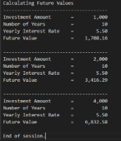

```Repository Link:``` [🔗 View CALC2000 Repository](https://github.com/bstearns07/CALC2000)

[⏫ Back to TOC](#table-of-contents)

# MathTutor

`Short Summary:` Creates a console-based math game that generates random math questions to answer and keeps track of your progress.
`Technologies Used:`
- C++
- Various Code Libraries: <iostream>, <cstdlib> / <ctime>, <iomanip>, <stdexcept>, <windows.h>
  
`Key Learning Concepts:` Interactive console game development, persistent data storage, vectors, function prototypes, header files
`Project Status:` ✅ Complete  
`Course / Self-Project:` CSC150 Programming Fundamentals
`Thumbnail Screenshot:`


```Repository Link:``` [🔗 View CALC2000 Repository](https://github.com/bstearns07/CALC2000)

[⏫ Back to TOC](#table-of-contents)
 
# CALC2000

`Short Summary:` This program displays the future value of 3 different investments after 10 years using a fixed interest rate  
`Technologies Used:`
- COBOL 6.4
- JCL (compile/link/go)
- z/OS • VS Code + Zowe
  
`Key Learning Concepts:` Variables, arithmetic, loops, formatted output, MOVE/COMPUTE/UNTIL/PIC  
`Project Status:` ✅ Complete  
`Course / Self-Project:` CIS352 Intro to Enterprise Computing  
`Thumbnail Screenshot:`


```Repository Link:``` [🔗 View CALC2000 Repository](https://github.com/bstearns07/CALC2000)

[⏫ Back to TOC](#table-of-contents)

# RPT2000

`Short Summary:` This program generates a sales report of customer vendors by reading data from another data member  
`Technologies Used:`
- COBOL 6.4
- JCL (compile/link/go)
- z/OS • VS Code + Zowe
  
`Key Learning Concepts:` Reading data from one member into another, data manipulation, data divisions, file divisions, print areas, switches  
`Project Status:` ✅ Complete  
`Course / Self-Project:` CIS352 Intro to Enterprise Computing  
`Thumbnail Screenshot:`

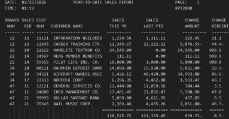

```Repository Link:``` [🔗 View RPT2000 Repository](https://github.com/bstearns07/RPT2000)

[⏫ Back to TOC](#table-of-contents)

# RPT3000

`Short Summary:` This program generates a sales report of customer vendors by reading data from another data member with non-repeating vendor and sales rep numbers
`Technologies Used:`
- COBOL 6.4
- JCL (compile/link/go)
- z/OS • VS Code + Zowe
  
`Key Learning Concepts:` Reading data from one member into another, data manipulation, data divisions, file divisions, print areas, if/else logic, switches  
`Project Status:` ✅ Complete  
`Course / Self-Project:` CIS352 Intro to Enterprise Computing  
`Thumbnail Screenshot:`

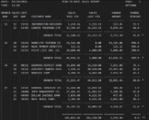

```Repository Link:``` [🔗 View RPT3000 Repository](https://github.com/bstearns07/RPT3000)

[⏫ Back to TOC](#table-of-contents)

# RPT5000

`Short Summary:` This program generates a sales report of customer vendors by reading data from another data member with non-repeating vendor and sales rep numbers featuring more COBOL features to streamline code  
`Technologies Used:`
- COBOL 6.4
- JCL (compile/link/go)
- z/OS • VS Code + Zowe
  
`Key Learning Concepts:` Conditional switches, WITH TEST AFTER, EVALUTE TRUE, SET statements
`Project Status:` ✅ Complete  
`Course / Self-Project:` CIS352 Intro to Enterprise Computing  
`Thumbnail Screenshot:`

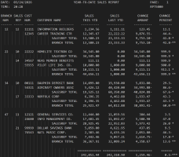

```Repository Link:``` [🔗 View RPT5000 Repository](https://github.com/bstearns07/RPT5000)

[⏫ Back to TOC](#table-of-contents)

# RPT6000

`Short Summary:` This program generates a sales report of customer vendors by reading data from another data member and looks up names from data from another member  
`Technologies Used:`
- COBOL 6.4
- JCL (compile/link/go)
- z/OS • VS Code + Zowe
  
`Key Learning Concepts:` Table data structures for data lookup with INITIALIZE, REDEFNINE, PACKED-DECIMAL statements  
`Project Status:` ✅ Complete  
`Course / Self-Project:` CIS352 Intro to Enterprise Computing  
`Thumbnail Screenshot:`

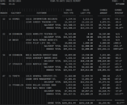

```Repository Link:``` [🔗 View RPT6000 Repository](https://github.com/bstearns07/RPT6000)

[⏫ Back to TOC](#table-of-contents)

# SEQ3000

`Short Summary:` Performs create/read/update/delete operations on a master data file based on information from both a sequential and index file.
`Technologies Used:`
- COBOL 6.4
- JCL (compile/link/go)
- z/OS • VS Code + Zowe
  
`Key Learning Concepts:` Creating/reading index files, writing to error log files, FILE-STATUS/HIGH-VALUE/LOW-VALUE statements  
`Project Status:` ✅ Complete  
`Course / Self-Project:` CIS352 Intro to Enterprise Computing  
`Thumbnail Screenshot:`

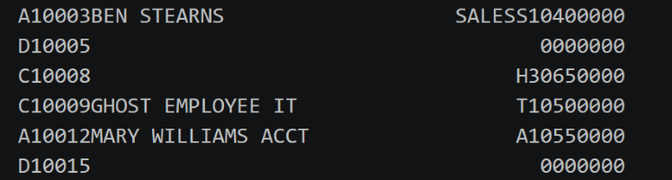

```Repository Link:``` [🔗 View SEQ3000 Repository](https://github.com/bstearns07/SEQ3000)

[⏫ Back to TOC](#table-of-contents)

# UTIL2000

`Short Summary:` Calculates an electric bill based off of fixed data in a 3-tiered format  
`Technologies Used:`
- COBOL 6.4
- JCL (compile/link/go)
- z/OS • VS Code + Zowe
  
`Key Learning Concepts:` Developing within a mainframe environment with ISPF, loops, DISPLAY/MOVE/COMPUTE/UNTIL statements  
`Project Status:` ✅ Complete  
`Course / Self-Project:` CIS352 Intro to Enterprise Computing  
`Thumbnail Screenshot:`

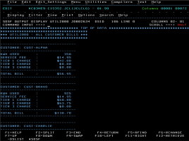

```Repository Link:``` [🔗 View UTIL2000 Repository](https://github.com/bstearns07/UTIL2000)

[⏫ Back to TOC](#table-of-contents)

# Checkout Receipt

`Short Summary:` Calculates the total of a grocery item based on price/quanity and other information from an html form  
`Technologies Used:`
- HTML5 (Semantic Markup)
- CSS3 (Layout & Styling)
- Vanilla JavaScript (ES6+)
  
`Key Learning Concepts:` Getting DOM element values, data validation, variables, arithmetic, document.querySelector()/parseFloat()/parseInt()/alert()/document.addEventListener() for button event handling  
`Project Status:` ✅ Complete  
`Course / Self-Project:` CSC 465 Advanced Web Development  
`Thumbnail Screenshot:`

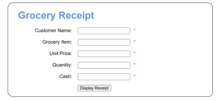

```Repository Link:``` [🔗 View Checkout Receipt Repository](https://github.com/bstearns07/Checkout-Receipt)

[⏫ Back to TOC](#table-of-contents)

# DictionaryAPI

`Short Summary:` Looks up the dictionary information of a word input by the user
`Technologies Used:`
- HTML5 (Semantic Markup) + Tailwind (Layout & Styling)
- Vanilla JavaScript (ES6+)
- Custom-made Node Express API
- [Free Dictionary API](https://dictionaryapi.dev/?ref=freepublicapis.com)
  
`Key Learning Concepts:` API calls and data parsing, Node Express APIs, find()/fetch() methods, asynchronous programming (async/await), Audio objects  
`Project Status:` ✅ Complete  
`Course / Self-Project:` CSC 465 Advanced Web Development  
`Thumbnail Screenshot:`

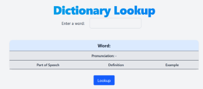

```Repository Link:``` [🔗 View DictionaryAPI Repository](https://github.com/bstearns07/DictionaryAPI)

[⏫ Back to TOC](#table-of-contents)

# Flashcards

`Short Summary:` Creates a game where you create your own flashcards and quiz yourself with them  
`Technologies Used:`
- HTML5 (Semantic Markup) + Tailwind (Layout & Styling)
- Vanilla JavaScript (ES6+)
  
`Key Learning Concepts:` Arrays, Switch statements, custom functions, DOM manipulation
`Project Status:` ✅ Complete  
`Course / Self-Project:` CSC 465 Advanced Web Development  
`Thumbnail Screenshot:`

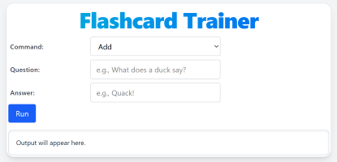

```Repository Link:``` [🔗 View Flashcards Repository](https://github.com/bstearns07/Flashcards)

[⏫ Back to TOC](#table-of-contents)

# HotColdGame

`Short Summary:` A number-guessing game that tells you if you're hot or cold
`Technologies Used:`
- HTML5 (Semantic Markup)
- Tailwind (Layout & Styling)
- Vanilla JavaScript (ES6+)
  
`Key Learning Concepts:` Random number generation, DOM CSS manipulation, "keydown" events, add/removeEventListener(), math.Abs() methods, switch(true) statements  
`Project Status:` ✅ Complete  
`Course / Self-Project:` CSC 465 Advanced Web Development  
`Thumbnail Screenshot:`


```Repository Link:``` [🔗 View HotColdGame Repository](https://github.com/bstearns07/HotColdGame)

[⏫ Back to TOC](#table-of-contents)

# MovieTracker

`Short Summary:` Maintains a personal list of movies in web storage so your list isn't lost if the browser closes.  
`Technologies Used:`
- HTML5 (Semantic Markup)
- CSS3 (Layout & Styling)
- Vanilla JavaScript (ES6+)
  
`Key Learning Concepts:` Class data structures, creating/importing modules, "import map" scripts, reading data in/out of web storage  
`Project Status:` ✅ Complete  
`Course / Self-Project:` CSC 465 Advanced Web Development  
`Thumbnail Screenshot:`

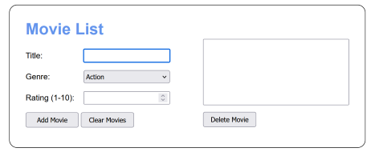

```Repository Link:``` [🔗 View MovieTracker Repository](https://github.com/bstearns07/MovieTracker)

[⏫ Back to TOC](#table-of-contents)

# RetirementProjector

`Short Summary:` Displays the growth of your retirement investment using a timer 
`Technologies Used:`
- HTML5 (Semantic Markup)
- CSS3 (Layout & Styling)
- Vanilla JavaScript (ES6+)
  
`Key Learning Concepts:` Time/Date manipulation, validation through html and custom methods, setInterval() for timer functions, regex patterns, local data storage  
`Project Status:` ✅ Complete  
`Course / Self-Project:` CSC 465 Advanced Web Development  
`Thumbnail Screenshot:`

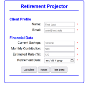

```Repository Link:``` [🔗 View RetirementProjector Repository](https://github.com/bstearns07/RetirementProjector)

[⏫ Back to TOC](#table-of-contents)

# SmartwatchFAQ

`Short Summary:` Displays the answers to frequently-asked questions about smartwatches using image swapping and toggling hidden elements on/off.
`Technologies Used:`
- HTML5 (Semantic Markup)
- Tailwind (Layout & Styling)
- Vanilla JavaScript (ES6+)
  
`Key Learning Concepts:` DOM manipulation through element.attributeName/ getAttribute()/ setAttribute()/ classList.toggle()/ classList.remove()/ nextSibling statements  
`Project Status:` ✅ Complete  
`Course / Self-Project:` CSC 465 Advanced Web Development  
`Thumbnail Screenshot:`


```Repository Link:``` [🔗 View RetirementProjector Repository](https://github.com/bstearns07/SmartwatchFAQ)

[⏫ Back to TOC](#table-of-contents)
